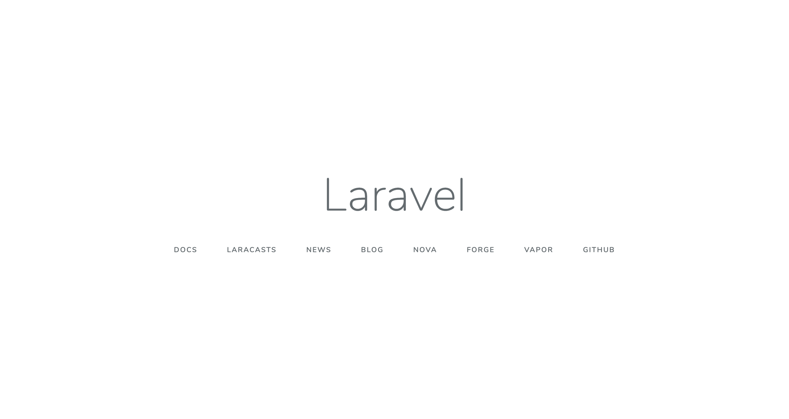
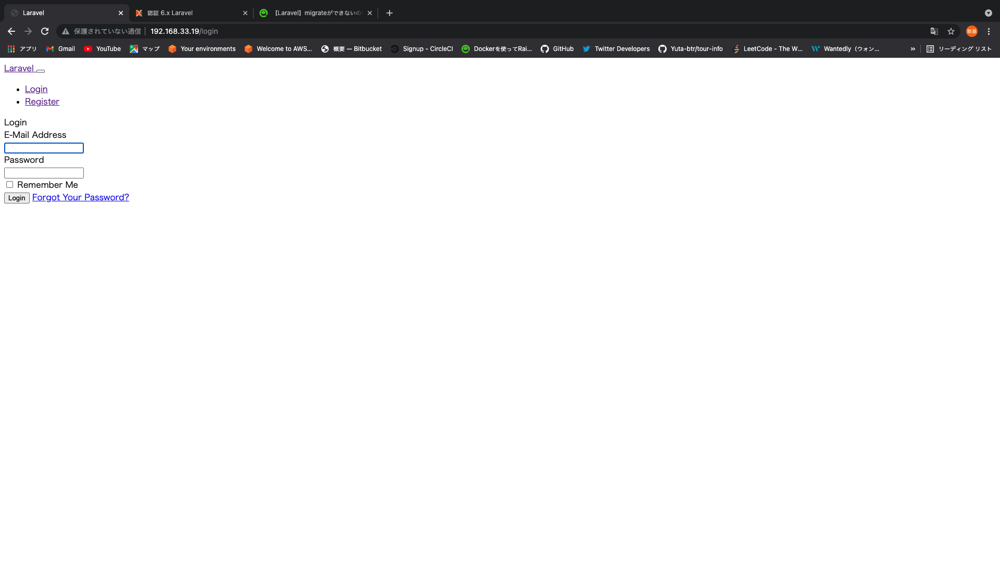

# Laravel ver6.0仮想環境の構築　(Mac)

## 環境構築の所感
仮想環境の概念を体系的に学べ、自ら実装することで開発環境に必要なソフトウエアを整理スロことができた。また、エラーに当たった際はバージョンの確認や、ファイルの記述ミス等を細かくチェックすることで、対処、回避することができるようになりました。
自分が手順的に当たったエラーが手順書内では出ないように作成しました。
また、ホストOS、ゲストOSでの作業を考えながら実装できました。

## 参考サイト

[Qiita vagrantマウントエラー](https://qiita.com/mao172/items/f1af5bedd0e9536169ae)  
[Laravel 6X 認証機能](https://readouble.com/laravel/6.x/ja/authentication.html)  

## 使用ソフトウェア
| TH 使用ソフトウェア| バージョン |
| :--- | :--- |
| PHP | 7.3 |
| Laravel | 6.2 |
| MySQL | 5.7 |
| Nginx | -- |

## Laravelのインストール
Laravelでアプリケーション開発を行う際には、Composerというパッケージ管理ソフトが必要です。
Homebrewを使用してインストールします。

```shell
$ brew install composer
```

composerのバージョンを確認ができたら、正常にインストールされています。

まず、Laravelのアプリケーションを配置したいディレクトリ作成し、移動してください。
```shell
$ cd 任意のディレクトリ
```

次に、先ほどインストールしたComposerのコマンドを実行します

```shell
$ composer create-project --prefer-dist laravel/laravel laravel_app "6.*"
```

今回は laravel_app という名前のプロジェクトにしました。
同名のディレクトリが出来上がっているはずですので ls コマンドで確認してみてください。

最後の 6.* はLaravelのバージョンを表し、プロジェクトごとに好きなバージョンを指定できます。

## ローカル開発サーバーを起動する
まず先ほど作成したプロジェクトディレクトリへ移動します。
```shell
cd laravel_app
```

次に、以下のコマンドを実行してください。

```php
php artisan serve
```

実行後、以下のように表示されたらサーバーの起動は成功です。
```
Laravel development server started: <http://127.0.0.1:8000>
```

実際にブラウザで確認してみましょう。http://127.0.0.1:8000

以下のような画面が表示されれば問題ありません。  

サーバーを終了させる場合は、ctrl + c を押してください。

## VirtualBoxのインストール
下記リンクからOS X hostsを選択  
[VirtualBox公式](https://www.virtualbox.org/wiki/Download_Old_Builds_6_0)  
下記コマンドを実行しVirtualBoxのウィンドウが出れば正常にインストール可能
```
$ virtualbox
```

## HomeBrewにVagrantをインストール
下記コマンドで簡単にインストールすることが可能です。
```
$ brew cask install vagrant
```
homebrewのバージョンが新しい場合は、下記のコマンドでインストールしましょう。
```
$ brew install --cask vagrant
```
下記コマンドを実行し、バージョンが確認できれば正常にインストールできています。
```
$ vagrant -v
```
## VagrantのBoxのダウンロード

今回はLinuxのCentOSのバージョン7のbox名 centos/7 を指定して実行してみましょう。
下記コマンドを実行する
```
vagrant box add centos/7
```
下記選択肢が表示されるので、3を選択してEnterを押す。
```
1) hyperv
2) libvirt
3) virtualbox
4) vmware_desktop

Enter your choice: 3

下記のように表示されたら完了です。
Successfully added box 'centos/7' (v1902.01) for 'virtualbox'!
```

## Vagrantの作業ディレクトリを用意する
以下いずれかのディレクトリの下にvagrant_testという名前でディレクトリを作成しましょう。
自分の作業用ディレクトリ
デスクトップ
作成したフォルダの中で以下のコマンドを実行します。

```
$ cd vagrant_test
$ vagrant init centos/7
```
実行後問題なければ以下のような文言が表示されます。

## Vagrantfileの編集
①、②はコメントイン  
③はコメントインのあと編集
```
変更点①
config.vm.network "forwarded_port", guest: 80, host: 8080

変更点②
config.vm.network "private_network", ip: "192.168.33.19"

変更点③
config.vm.synced_folder "../data", "/vagrant_data"

↓以下に編集
config.vm.synced_folder "./", "/vagrant", type:"virtualbox"
```

## Vagrant プラグインのインストール
```shell
$ vagrant plugin install vagrant-vbguest
$ vagrant plugin list
```

## Vagrantを使用してゲストOSの起動
```shell
$ vagrant up
```

## マウントエラーがでた場合
[こちら](https://qiita.com/mao172/items/f1af5bedd0e9536169ae)からエラー対処してください

## ゲストOSへのログイン
```shell
$ vagrant ssh
```
コマンドを実行した後、以下のような表記になっていればゲストOSにログインしていることになります。
```
Welcome to your Vagrant-built virtual machine.
[vagrant@localhost ~]$
ssh vagrant@127.0.0.1 -i /Users/xxxx/.vagrant/machines/default/virtualbox -p 2222
[vagrant@localhost ~]$
```

## パッケージのインストール
```
$ sudo yum -y install パッケージ名
$ sudo yum -y groupinstall "導入する名称"
#グループパッケージをインストールしていきましょう。下記のコマンドを実行してください。
$ sudo yum -y groupinstall "development tools"
```

## PHPのインストール
```
$ sudo yum -y install epel-release wget
$ sudo wget http://rpms.famillecollet.com/enterprise/remi-release-7.rpm
$ sudo rpm -Uvh remi-release-7.rpm
$ sudo yum -y install --enablerepo=remi-php73 php php-pdo php-mysqlnd php-mbstring php-xml php-fpm php-common php-devel php-mysql unzip
$ php -v
```

## composerのインストール
```
$ php -r "copy('https://getcomposer.org/installer', 'composer-setup.php');"
$ php composer-setup.php
$ php -r "unlink('composer-setup.php');"
```

## どのディレクトリにいてもcomposerコマンドを使用できるようfileの移動を行います
```shell
$ sudo mv composer.phar /usr/local/bin/composer
$ composer -v
```

## Laravelアプリケーションのコピー作成
現在ゲストOSにログインしている人は一旦 exit コマンドを実行してログアウトしてください。  
その後、以下のコマンドを自身の環境に合わせて実行し、Laravelプロジェクトのコピーを vagrant_testディレクトリ下に作成します。

```shell
$ cd vagrant_test
$ cp -r laravel_appディレクトリまでの絶対パス ./
```

## Apacheのインストール
まだゲストOSにログインしていない方は vagrant_test ディレクトリにて vagrant ssh コマンドを実行してログインしてください。
```shell
$ sudo yum -y install httpd
```
下記コマンドでバージョンが確認できれば正常にインストールされています。
```shell
$ httpd -v
```
```shell
$ sudo vi /etc/httpd/conf/httpd.conf
```
```shell
省略

変更点①
DocumentRoot "/var/www/html"
↓ 以下に編集
DocumentRoot "/vagrant/laravel_app/public"

省略

変更点②

<Directory "/var/www/">
  AllowOverride None
  Require all granted
</Directory>

↓ 以下に編集
<Directory "/vagrant/laravel_app/public">
  AllowOverride All
  Require all granted
</Directory>

省略

変更点③
User apache
Group apache
 ↓ 以下に編集
User vagrant
Group vagrant
```

## Apacheの起動
以下のコマンドを実行して起動をします。

```shell
$ sudo systemctl start httpd
```
また、下記のコマンドを実行してApacheが正常に起動しているか確認してください。  
Activeの箇所にinactive あるいは falied という記述がある場合は、Apacheの起動ができていないか設定ファイルの編集ミスで起動に失敗していますので、再度コマンドを実行し直すか編集した箇所を見直してください。

```shell
$ sudo systemctl status httpd
```

以下がコマンド実行結果の例です。

```shell
httpd.service - The Apache HTTP Server
   Loaded: loaded (/usr/lib/systemd/system/httpd.service; disabled; vendor preset: disabled)
   Active: active (running) since 土 XXXX-XX-XX XX:XX:XX UTC; 2s ago
     Docs: man:httpd(8)
           man:apachectl(8)
 Main PID: 16536 (httpd)
   Status: "Processing requests..."
   CGroup: /system.slice/httpd.service
           ├─16536 /usr/sbin/httpd -DFOREGROUND
           ├─16537 /usr/sbin/httpd -DFOREGROUND
           ├─16538 /usr/sbin/httpd -DFOREGROUND
           ├─16539 /usr/sbin/httpd -DFOREGROUND
           ├─16540 /usr/sbin/httpd -DFOREGROUND
           └─16541 /usr/sbin/httpd -DFOREGROUND

 X月 XX XX:XX:XX localhost.localdomain systemd[1]: Starting The Apache HTTP Server...
 X月 XX XX:XX:XX localhost.localdomain httpd[16536]: AH00558: httpd: Could not reliably determine the server's fully qualified domain name, using ... message
 X月 XX XX:XX:XX localhost.localdomain systemd[1]: Started The Apache HTTP Server.
 Hint: Some lines were ellipsized, use -l to show in full.
```

起動しましたらブラウザに http://192.168.33.19 と入力し確認してみてください。  
ブラウザ画面に、Laravelのwelcomeページが表示されましたでしょうか？  

おそらく答えは、「No」だと思います。画面すら表示されずの状態かと思います。  
ではなぜこのような画面が表示されているのか、答えは、 ブラウザに書いてあります。  

表示されている文言の下部に「ファイヤーウォール」という単語が確認できますでしょうか？  
聞きなれない単語かと思いますが、セキュリティの観点では「ファイヤーウォール」は大切な機能であるため、起動状態のままホストOS側からアクセスできるようにしてあげましょう。


## ファイヤーウォールの起動
agrantfileの編集をした際を思い出してください。  
config.vm.network "forwarded_port", guest: 80, host: 8080 と記述されていた箇所のコメントを解除したと思います。
この 80 という数字は、httpという通信を行うためのポートと呼ばれる窓口番号です。
なのでファイヤーウォールに対してこの80ポートを経由したhttp通信によるアクセスを許可するためのコマンドを実行します。

```shell
$ sudo systemctl start firewalld.service
$ sudo firewall-cmd --add-service=http --zone=public --permanent

#新たに追加を行ったのでそれをファイヤーウォールに反映させるコマンドも合わせて実行します。
$ sudo firewall-cmd --reload
```

もしまだ表示できないようであれば、一度以下のコマンドを実行してください。
```
$ sudo systemctl restart httpd
```
## Forbidden 403 というエラーが出た場合
viエディタを使用してSELinuxの設定を変更します。  
「SELinux コンテキスト」の不一致によりエラーが出ているので、SELinuxを無効化します。
```
$ sudo vi /etc/selinux/config
```
viエディタが開き設定ファイルが表示されるので下記の部分を探してください。
```
# This file controls the state of SELinux on the system.
# SELINUX= can take one of these three values:
# enforcing - SELinux security policy is enforced.
# permissive - SELinux prints warnings instead of enforcing.
# disabled - No SELinux policy is loaded.
SELINUX=enforcing
```
こちらの記述を下記のように書き換えて、保存してください。
```
SELINUX=disabled
```

設定を反映させるためにゲストOSを再起動する必要があるので、ゲストOSをから一度ログアウトして下記コマンドを実行してください。
```
$ exit
$ vagrant reload
```
リロードが完了したら再度ゲストOSにログインしましょう。
```
$ vagrant ssh
```
再度Apacheを起動します。
```
$ sudo systemctl start httpd
```
これでLaravelのwelcomeページが表示されているはずです。画面を確認してみてください。

## データベースのインストール
```shell
sudo wget https://dev.mysql.com/get/mysql57-community-release-el7-7.noarch.rpm
sudo rpm -Uvh mysql57-community-release-el7-7.noarch.rpm
sudo yum install -y mysql-community-server
mysql --version
```
versionの確認ができましたらインストール完了です。
次にMySQLを起動し接続を行います。
```shell
sudo systemctl start mysqld
mysql -u root -p
Enter password:
```
MacあるいはWindowsにMySQLをインストールしたときは、何も入力せずに接続が可能だったかと思いますが  
今回はデフォルトでrootにパスワードが設定されてしまっています。  
まずはpasswordを調べ、接続しpassswordの再設定を行っていく必要があります。
```shell
sudo cat /var/log/mysqld.log | grep 'temporary password'  
# 上記コマンドを実行し、下記のように表示されたらOKです
2017-01-01T00:00:00.000000Z 1 [Note] A temporary password is generated for root@localhost: hogehoge
```
```shell
下記が記載されている箇所に存在するランダムな文字列がパスワードとなります。
hogehoge
```
先程出力したランダム文字列をコピー後、再度以下のコマンドを実行し、パスワード入力時にペーストしてください。
```mysql
$ mysql -u root -p
$ Enter password:
mysql >
```

次に接続した状態でpasswordの変更を行います。
```mysql
mysql > set password = "新たなpassword";
```

新たなpasswordには、必ず大文字小文字の英数字 + 記号かつ8文字以上の設定をする必要があります。
MySQL5.7のパスワードポリシーは厳格で開発段階では非常に面倒のため、以下の設定を行いシンプルなパスワードに初期設定できるようにMySQLの設定ファイルを変更します。(ステージング環境や本番環境で使用するDBにはポリシーを遵守したパスワードを設定してください。)
mysqlをquitで終了させてから、ゲストOSで下記コマンドを入力し編集してください。

```shell
$ sudo vi /etc/my.cnf
```
```shell
# 省略

[mysqld]

# 省略

# read_rnd_buffer_size = 2M
datadir=/var/lib/mysql
socket=/var/lib/mysql/mysql.sock

# 下記の一行を追加
validate-password=OFF
```
編集後はMySQLサーバの再起動が必要です。
```shell
$ sudo systemctl restart mysqld
```
## データベースの作成
実際にLaravelのTodoアプリケーションを動かす上で使用するデータベースの作成を行います。
MySQLにログイン後、下記コマンドを実行。

```mysql
mysql > create database laravel_app;
```
Query OKと表示されたら作成は完了となります。

Laravelを動かす
laravel_appディレクトリ下の .env ファイルの内容を以下に変更してください。
```shell
DB_CONNECTION=mysql
DB_HOST=127.0.0.1
DB_PORT=3306
# ↓　コピーしてきたlaravel_appのプロジェクト名(今回はlaravel_app)
DB_DATABASE=laravel_app
DB_USERNAME=root
DB_PASSWORD=
# ↓ 以下に編集
DB_PASSWORD=登録したパスワード
```
では、laravel_appディレクトリに移動して php artisan migrate を実行します。
マイグレーションが問題なく実行できた後、ブラウザ上でユーザー登録ができればローカルで動かしていたLaravelを仮想環境上で全く同じように動かすことができたということになります。

## Nginxのインストール
先ほどまで起動させていたApacheを停止させます。
```shell
$ sudo systemctl stop httpd
```

下記コマンドで停止しているか確認
```shell
$ sudo systemctl status httpd
```

Nginxの最新版をインストールしていきます。
viエディタを使用して以下のファイルを作成します。
```shell
$ sudo vi /etc/yum.repos.d/nginx.repo
```
書き込む内容は以下になります。

```shell
[nginx]
name=nginx repo
baseurl=https://nginx.org/packages/mainline/centos/\$releasever/\$basearch/
gpgcheck=0
enabled=1
```

書き終えたら保存して、以下のコマンドを実行しNginxのインストールを実行します。

```shell
$ sudo yum install -y nginx
$ nginx -v
```

Nginxのバージョンは確認できたでしょうか？
ではNginxの起動をしましょう。

```shell
$ sudo systemctl start nginx
```
ブラウザにて http://192.168.33.19 と入力し、NginxのWelcomeページが表示されましたでしょうか？
表示されたら問題なく動いていますので次に進みましょう。

## Laravelを動かす
Apache同様にNginxにも設定ファイルが存在しているので編集を行います。  
Apacheと異なりNginxは、php-fpmとセットで使用します。  
php-fpmにも設定ファイルが存在しているのでこちらも編集を行います。  

使用しているOSがCentOSの場合、/etc/nginx/conf.d ディレクトリ下の default.conf ファイルが設定ファイルとなります。

```shell
$ sudo vi /etc/nginx/conf.d/default.conf
```
下記のように編集してください。
```
server {
  listen       80;
  server_name  192.168.33.19; # Vagranfileでコメントを外した箇所のipアドレスを記述してください。
  # ApacheのDocumentRootにあたります
  root /vagrant/laravel_app/public; # 追記
  index  index.html index.htm index.php; # 追記

  #charset koi8-r;
  #access_log  /var/log/nginx/host.access.log  main;

  location / {
      #root   /usr/share/nginx/html; # コメントアウト
      #index  index.html index.htm;  # コメントアウト
      try_files $uri $uri/ /index.php$is_args$args;  # 追記
  }

  # 省略

  # 該当箇所のコメントを解除し、必要な箇所には変更を加える
  # 下記は root を除いたlocation { } までのコメントが解除されていることを確認してください。

  location ~ \.php$ {
  #    root           html;
      fastcgi_pass   127.0.0.1:9000;
      fastcgi_index  index.php;
      fastcgi_param  SCRIPT_FILENAME  /$document_root$fastcgi_script_name;    #$fastcgi_script_name以前を /$document_root/に変更
      include        fastcgi_params;
  }
```

Nginxの設定ファイルの変更は、以上です。
次に php-fpm の設定ファイルを編集していきます。
```
$ sudo vi /etc/php-fpm.d/www.conf
```
変更箇所は以下になります。
```
;24行目近辺
user = apache
# ↓ 以下に編集
user = nginx

group = apache
# ↓ 以下に編集
group = nginx
```
設定ファイルの変更に関しては、以上となります。
では早速起動しましょう(Nginxは再起動になります)。
```shell
$ sudo systemctl restart nginx
$ sudo systemctl start php-fpm
```

再度ブラウザにて、 http://192.168.33.19 を入力して確認してください.

pache同様にTodoアプリケーションを動かすことはできたでしょうか？？
画面は表示されますが、以下のようなLaravelのエラーが表示されると思います。
```shell
The stream or file "/vagrant/laravel_app/storage/logs/laravel.log" could not be opened: failed to open stream: Permission denied
```
これは 先程php-fpmの設定ファイルの user と group を nginx に変更したと思いますが、ファイルとディレクトリの実行 user と group に nginx が許可されていないため起きているエラーです。

以下のコマンドを実行してみてください。
```shell
$ ls -la ./ | grep storage && ls -la storage/ | grep logs && ls -la storage/logs/ | grep laravel.log
```

出力結果から、storageディレクトリも logsディレクトリも laravel.logファイルも全て user と group が
vagrant となっていますので、これでは nginx というユーザーの権限をもってlaravel.logファイルへの書き込みができません。

では、以下のコマンドを実行して nginx というユーザーでもログファイルへの書き込みができる権限を付与してあげましょう。

## パーミッション変更
```shell
$ cd /vagrant/laravel_app
$ sudo chmod -R 777 storage
```

http://192.168.33.19 にアクセスして正常にLaravelのWelcome画面の表示をしてください。

## Laravelに認証機能の実装
このコマンドは新しくインストールしたアプリケーションでのみ実行すべきで、レイアウトビュー、登録ログインビューをインストールし、同時にすべての認証エンドポイントのルートも定義します。HomeControllerも、ログイン後に必要となる、アプリケーションのダッシュボードのために生成されます。

```
$ composer require laravel/ui "^1.0" --dev

$ php artisan ui vue --auth
```

## データベースのマイグレーション
ゲストOSにログインした後、下記コマンドを実行しマイグレーションします。
```
$ php artisan migrate
```

## パーミッションの変更
vagrantfileに下記一文を追加した後、vagrant reload　をして下さい
```
config.vm.synced_folder "./", "/vagrant", type:"virtualbox", :mount_options => ["dmode=777,fmode=777"]
```

vagrant/vagrant/laravel_appにディレクトリを変更し。下記コマンドを実行します。
```
$ sudo chmod 777 /var
```
http://192.168.33.19/home にアクセスして正常に認証画面の表示されたら完了です。

